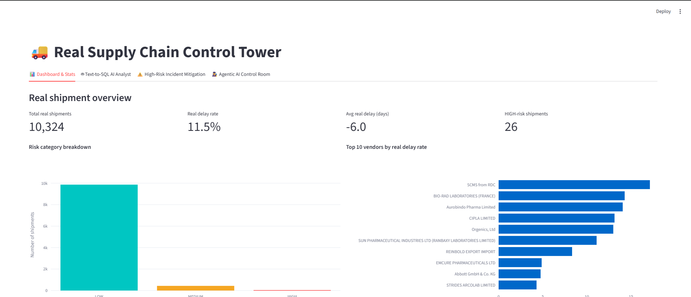

# 🚛 AI Control Tower for Supply Chain Risk Management
An end-to-end **Agentic AI & ML Control Tower** for real-time logistics risk analytics, automated root-cause investigation, interactive alternative routing recommendations, and Text-to-SQL data exploration. Built on a Medallion Lakehouse Architecture (Bronze → Silver → Gold) using DuckDB, Scikit-Learn, Gemini 3.5 Flash, and Streamlit.

---



---

## ✨ Features

- 🏗️ **Medallion Data Architecture**: 
  - **Bronze Layer**: Raw delivery history ingestion.
  - **Silver Layer**: Data cleaning, text normalization, and invalid value handling.
  - **Gold Layer**: Feature engineering, aggregation, and ML risk scoring.
- 🎯 **Machine Learning Delay Prediction**: Random Forest model trained on historical shipment data (achieves **~88.5% accuracy** on unseen test data).
- 🤖 **Agentic Control Room**:
  - **Root-Cause Investigation Agent**: Investigates HIGH-risk shipments using custom tools (vendor historical reliability, shipment mode delay rates, weight percentile distribution) and drafts customer delay mitigation emails.
  - **Alternative-Routing Recommendation Agent**: Evaluates real delay statistics across transport modes and recommends optimal alternative routes.
- 💬 **Text-to-SQL AI Analyst**: Natural language queries converted directly to DuckDB SQL queries via Gemini LLM with guardrails against unrelated queries.
- 📊 **Interactive Streamlit Dashboard**: Real-time KPI metrics, risk category breakdowns, interactive analytics, mitigation workflows, and mailto action links.

---

## 📦 Required Packages & Dependencies

The project relies on Python 3.10+ and the following key libraries:

| Package | Version / Range | Description |
| :--- | :--- | :--- |
| `duckdb` | `>=1.0.0` | In-memory analytical SQL database engine & Parquet processor |
| `pandas` | `>=2.0.0` | Data manipulation and tabular processing |
| `numpy` | `>=1.24.0` | Numerical computing and array operations |
| `scikit-learn` | `>=1.3.0` | Random Forest machine learning classification model |
| `streamlit` | `>=1.30.0` | Interactive web dashboard UI |
| `plotly` | `>=5.18.0` | Dynamic data visualization charts |
| `google-genai` | `>=0.1.0` | Official Google Gemini SDK for LLM & Agentic Function Calling |
| `pyarrow` | `>=14.0.0` | High-performance Parquet format reading & writing |
| `python-dotenv` | `>=1.0.0` | Secure environment variable management (`.env`) |

---

## 🚀 Step-by-Step Setup Instructions

### 1. Clone the Repository
```bash
git clone https://github.com/aryansuryas/A4.git
cd A4/supply_chain_workshop
```
*(If running directly inside `supply_chain_workshop`, stay in this directory)*.

---

### 2. Set Up Virtual Environment

#### On Windows (PowerShell / Command Prompt):
```powershell
python -m venv venv
.\venv\Scripts\Activate.ps1
# Or in cmd.exe: .\venv\Scripts\activate.bat
```

#### On macOS / Linux:
```bash
python3 -m venv venv
source venv/bin/activate
```

---

### 3. Install Dependencies
```bash
pip install --upgrade pip
pip install -r requirements.txt
```

---

### 4. Configure Environment Variables (`.env`)

1. Get a free Google Gemini API Key from [Google AI Studio](https://aistudio.google.com/app/api-keys).
2. Copy `.env.example` to create `.env`:
   ```bash
   cp .env.example .env
   ```
3. Open `.env` and add your Gemini API Key:
   ```env
   GEMINI_API_KEY=AIzaSyYourActualGeminiApiKeyHere...
   ```

> 🔒 **Security Note**: The `.env` file is excluded via `.gitignore` to keep your private API key safe from git commits.

---

## ⚙️ Running the Pipeline (In Order)

Execute the scripts in numerical order to build the data pipeline from raw CSV to live ML predictions and launch the dashboard.

### 1️⃣ Step 1: Ingest Raw Data (Bronze Layer)
Loads raw shipment delivery dataset into raw Parquet format.
```bash
python 01_ingest_bronze.py
```

### 2️⃣ Step 2: Clean & Validate (Silver Layer)
Cleans junk text, normalizes data types, and validates shipment outcomes.
```bash
python 02_clean_silver.py
```

### 3️⃣ Step 3: Train ML Model & Score (Gold Layer)
Trains a Random Forest classifier to predict shipment delays and computes risk probabilities (`LOW`, `MEDIUM`, `HIGH`).
```bash
python 03_model_gold.py
```

### 4️⃣ Step 4: Export Layer Comparison CSVs (Optional)
Exports stage-by-stage comparison files (`raw` → `bronze` → `silver` → `gold`) to `data/exports/`.
```bash
python 04_export_for_comparison.py
```

### 5️⃣ Step 5: Run AI Agentic Monitor (Optional)
Runs both AI Agents in terminal mode to investigate HIGH-risk shipments.
```bash
python 05_agentic_monitor.py
```

### 6️⃣ Step 6: Launch Streamlit Control Tower Dashboard 🚀
Launches the web UI for interactive analytics and AI decision room.
```bash
streamlit run 06_app.py
```
After running, access the dashboard in your browser at: **`http://localhost:8501`** (or `http://localhost:8503`).

---

## 📁 Repository Directory Structure

```text
supply_chain_workshop/
├── 01_ingest_bronze.py           # Ingest raw CSV -> Bronze Parquet
├── 02_clean_silver.py            # Clean & normalize -> Silver Parquet
├── 03_model_gold.py             # Train ML model & score -> Gold Parquet
├── 04_export_for_comparison.py  # Write comparison CSVs to data/exports/
├── 05_agentic_monitor.py        # Terminal runner for AI agents
├── 06_app.py                    # Streamlit Dashboard Application
├── agentic_core.py              # Root-Cause & Routing Agent logic
├── ai_copilot.py                # Text-to-SQL LLM Copilot logic
├── SCMS_Delivery_History_Dataset.csv # Raw Dataset
├── requirements.txt             # Python project dependencies
├── .env.example                 # Environment variables template
├── .gitignore                   # Excluded files & folders
├── assets/
│   └── dashboard_preview.png    # Dashboard preview screenshot
└── data/                        # Generated Lakehouse storage
    ├── raw/
    ├── bronze/
    ├── silver/
    ├── gold/
    └── exports/
```

---

## 🔧 Troubleshooting & Tips

- **Windows Console Encoding**: On Windows PowerShell/CMD, set `PYTHONIOENCODING=utf-8` if you encounter console encoding issues:
  ```powershell
  $env:PYTHONIOENCODING='utf-8'
  ```
- **Gemini Rate Limits**: The Gemini free tier limit is 15 requests per minute. `agentic_core.py` includes automatic retry logic and timeouts (`REQUEST_TIMEOUT_SECONDS = 30`) to handle network latency gracefully.

---

## 📝 License
Distributed under the MIT License. See `LICENSE` for more information.
